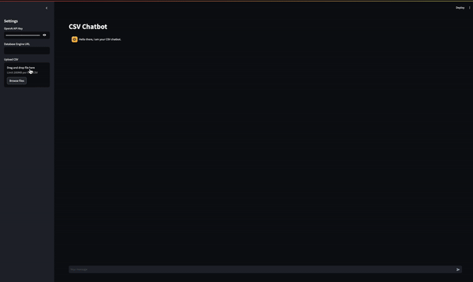

# ChatCSV



ChatCSV is an AI-powered chatbot application that allows users to interact with CSV data or a database through natural language queries. Built with Streamlit, Langchain, OpenAI, and SQLAlchemy, this application provides a friendly and professional AI assistant to help you with your data.

## Features

- **CSV and Database Integration**: Upload CSV files or connect to a database using a URL.
- **Natural Language Queries**: Interact with your data using natural language, powered by OpenAI's GPT models.
- **Streamlit Interface**: A simple and intuitive web interface for easy interaction.

## Getting Started

### Prerequisites

- Python 3.8 or higher
- Streamlit
- OpenAI API Key
- SQLAlchemy

### Installation

1. Clone the repository:

    ```sh
    git clone https://github.com/xmpuspus/ChatCSV.git
    cd ChatCSV
    ```

2. Install the required packages:

    ```sh
    ./install_requirements.sh
    ```

### Running the Application

1. Set up your OpenAI API key and run the Streamlit app:

    ```sh
    streamlit run app.py
    ```

2. Open your browser and go to `http://localhost:8501`.

### Usage

1. **Upload CSV**: Use the sidebar to upload your CSV file.
2. **Connect to Database**: Alternatively, provide a database engine URL.
3. **Chat**: Interact with your data using the chat interface.

### File Structure

- `app.py`: The main application script.
- `requirements.txt`: A list of dependencies required for the project.
- `install_requirements.sh`: A script to install the required dependencies.
- `sample_demo.gif`: A demo of the application in action.

### Dependencies

```sh
# requirements.txt
streamlit
pandas
langchain
sqlalchemy
openai
